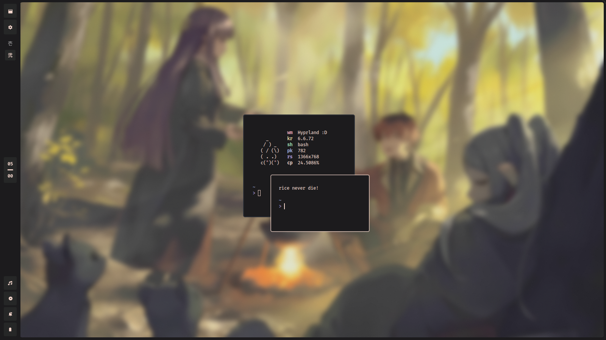

 <br>

<!-- badges: start -->


<!-- badges: end -->

This is my daily driver dotfiles, it uses a bunch of waybar and bash scripts. Its also uses Bliss themes nor colorschemes. Feel free to use it!

## **Table of Contents**
- [Shoutout](#shoutout)
- [Installation](#installation)
- [Gallery](#gallery)
- [Keybindings](#keybindings)

## **Shoutout**


- **[Hyprland](https://github.com/hyprwm/hyprland)**: Window Manager / Compositor
- **[Waybar](https://github.com/Alexays/Waybar)**: Bar and Widgets
- **[Foot](https://codeberg.org/dnkl/foot)**: Terminal
- **[Chrome](https://aur.archlinux.org/packages/google-chrome)**: Browser
- **[PcmanFM](https://archlinux.org/packages/extra/x86_64/pcmanfm-gtk3/)**: File Manager
- **[NeoVim](https://neovim.io)**: Text Editor
- **[Vesktop](https://github.com/Vencord/Vesktop)**: Discord Client

and others as well.

## **Installation**
> [!NOTE]
> I'm only using **Arch linux** and will only update the Installation Script for **Arch based** distribution, otherwise you can install everything manually.

> [!IMPORTANT]
> - The installation script uses **bash**, so install it if you haven't.
> - You can't be **ROOT** when run the script. Make sure you are **not ROOT!** otherwise it won't work.

- Clone with `git clone`, cd and run the Installation script
```bash
git clone https://github.com/veillain/dotfiles
cd dotfiles
./install
```

- Install Manually
wip.

## **Gallery**
| Floating | Tiling |
| - | - |
|  |  |
| Launcher | Lockscreen |
|  |  |

## **Keybindings**
These are the basic keybinds. Read through [Wiki](https://github.com/veillain/dotfiles/wiki) for more keybinds.
> [!NOTE]
> `Mod` = `Left Alt`

| Keys | Function |
| - | - |
| `Mod + T` | Launch Terminal (Foot) |
| `Mod + Q` | Kill Active Window |
| `Mod + A` | Launch App Launcher (Rofi) |
| `Mod + W` | Toggle Active Window from tiling/floating |
| `Mod + F` | Toggle Fullscreen |
| `Mod + BackSpace` | Lock Screen (Hyprlock) |
| `Mod + [1-10]` | Switch to Workspace[1-10] |
| `Mod + Shift + [1-10]` | Move Active Window to Workspace[1-10] |

## **Kanata**
These are some keys that i remap using `Kanata`. It's called `Home Row Mods`.
| Keys | When tapped | When Holded |
| - | - | - |
| `A` | A | Alt |
| `S` | S | Meta |
| `D` | D | Shift |
| `F` | F | Control |
| H | H | Home |
| `J` | J | Control |
| `K` | K | Shift |
| `L` | L | End |
| `;` | ; | Meta |
| `Capslock` | Escape | Control |

## **License**
This project is licensed under the GNU General Public License V3.0 See the [LICENSE](LICENSE) file for details.

## **Supports**
You can support me / my work with:
<a href='https://ko-fi.com/veillain' target='_blank'>
